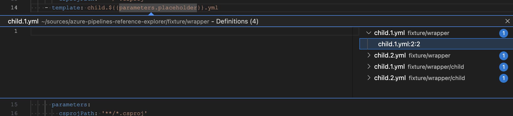

# Azure DevOps Pipeline Templates
1. Open any project that has a `.yml` file with templates
2. Select the template filename and use `Go to Definition`

## Development
- Clone this repository
- Open your clone in VS Code
- Run `npm install`
- Run the `Run Extension` target from the Debug View
